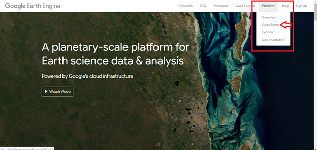
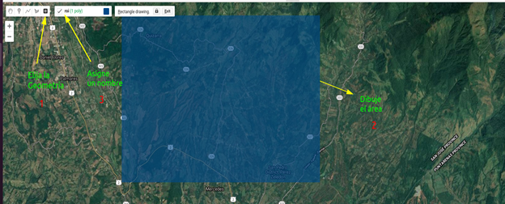

# Introducción a Google Earth Engine


<h1>Introducción al uso de imágenes de Radar de Apertura Sintética en Google Earth Engine aplicado a la agricultura</h1> 
<h2>Manual de introducción al uso de Google Earth Engine</h2> 

<p>Este manual fue elaborado por la Escuela de Geografía de la Universidad de Costa Rica, para el cual colaboraron Emmanuel Jesús Céspedes-Rivera y Cristian Aguilar-Barboza en calidad de asistentes avanzados del proyecto "Transformación digital: Incorporación de tecnología SAR en la gestión de riesgos, agricultura y recursos naturales para Centroamérica", en el marco del proyecto UCREA-IICA.</p>
<p>Este proyecto está coordinado por el Dr Edgar Espinoza Cisneros y co-cordinado por MSc María José Molina Montero. Para mayor información contactar a maria.molinamontero@ucr.ac.cr .</p>

<p>Índice</p> 

<p><li><a href="#Sección1">1. Prerrequisitos</a></li>
<li><a href="#Sección2">2. Introducción</a></li>
<li><a href="#Sección3">3. Interfaz de Google Earth Engine</a></li>
<li><a href="#Sección4">4. Procesamiento y análisis</a></li>
<li><a href="#Sección5">5. Conclusiones y recomendaciones</a></li>
<li><a href="#Sección7">6. Bibliografía</a></li></p> 

<p><h2 id="Sección1">1. Prerrequisitos</h2></p>


<p>Para ejecutar esta rutina el usuario previamente debe crear una cuenta en la plataforma Google Earth Engine (GEE), ingresando en <p><a href="https://earthengine.google.com/" target="_blank">https://earthengine.google.com/</a></p>. GEE, es una plataforma para la visualización y análisis de datos geoespaciales en la nube, por lo tanto, no existe la necesidad de invertir equipos y programas especializados (Google Earth Engine, 2019). GEE tiene disponible repositorios de información entre los cuales se encuentran: series temporales de Landsat, Sentinel, MODIS, SRTM, entre otros.</p> 

<p>Esta plataforma utiliza en su editor de código el lenguaje de programación JAVA, aunque también posee una API Python vinculada al Google Drive.</p> 

Como guía para crear una cuenta en GEE ingrese a: 


p><a href="https://www.youtube.com/watch?v=E60J32Umqeo" target="_blank">"https://www.youtube.com/watch?v=E60J32Umqeo </a></p>


<p><h2 id="Sección2">2. Introducción</h2></p>

<p>El monitoreo de cultivos es una de las principales herramientas en agricultura, la estimación del área de cobertura, productividad, incidencia de enfermedades, evolución o cambios en la estructura de los cultivos...etc; estas actividades resultan fundamentales en términos de estudiar y mejorar la actividad agrícola (Mutanga & Kumar, 2019).</p>

<p>GEE es una plataforma en la nube que posee acceso de diferentes repositorios de información, caso de Landsat, MODIS, Sentinel, SoilGrids, SRTM, ALOS-Palsar, HydroSheds entre muchos otros que favorecen el monitoreo agrícola de forma gratuita y sin cargas computacionales elevadas.</p>

<p>La detección remota con sensores ópticos requieren de observaciones con productos de buena calidad, libre de nubes o sombras de nubes para minimizar la confusión espectral de los datos (Shen et al., 2019), sin embargo, en zonas tropicales las coberturas nubosas son constantes y abundantes, su aplicación resulta limitada (Flores et al., 2019). Debido a este aspecto, se ha implementado el uso de la imágenes SAR, la cual despeja la limitante de la nubosidad y permite la obtención continua de información (Flores et al., 2019).</p>

<p>En tanto los datos SAR son efectivos en este tipo de estudios, sin embargo, la descarga y pre-procesamiento de los datos en “crudo” directamente en el ordenador requiere de alta capacidad de procesamiento, elemento que puede ser omitido con el uso de GEE. El cual, provee información pre-procesada y lista para el análisis y monitoreo agrícola.</p> 

<p>En este manual se muestra una metodología simple para el monitoreo de cultivos de caña, a partir de la interpretación y análisis espacio-temporal de los valores de retrodispersión.</p>

<p><h3>2.1 Objetivos de aprendizaje:</h3></p>

<p><li>Introducir al manejo de la interfaz de editor de código de GEE.</li>
<li>Analizar los procesos de interacción de la señal SAR con la superficie terrestre.</li>
<li>Observar y monitorear los cambios temporales en cultivos de caña.</li>
<li>Identificar ventajas y desventajas del uso de imágenes SAR en el monitoreo agrícola con GEE.</li></p>

<p><h2 id="Sección3">3. Interfaz de Google Earth Engine</h2></p>


<p>Para abrir el editor de código ingrese en: <a href="https://earthengine.google.com/" target="_blank">https://earthengine.google.com/</a>, y ubiquese en la opción  (Fig 1), luego seleccione Code Editor.</p> 
  

<h4 id="Sección3">Fig 1. Acceso al code editor desde la página web de Google Earth Engine.</h4>

<p>Una vez hecho esto se le desplegará el editor de código de GEE, el cual se detalla en la Fig 2.</p> 
  

<h4 id="Sección3">Fig 2. Interfaz de editor de código GEE.</h4>

<p>Es importante señalar que en la plataforma en “repositorio de código” en la sección de <strong>“Examples”</strong> puede encontrar una serie de códigos de ejemplo con diferentes tipos de datos de origen con los cuales puede experimentar y editar a conveniencia para diferentes aplicaciones.<p>
  
<p><h2 id="Sección4">4. Procesamiento y análisis</h2></p>

<p>Primero selecciona un área de interés, para esto puede utilizar el administrador de geometrías, para esto puede seleccionar la opción de polígonos o puntos. En este caso, dibuje un rectángulo sobre el área a analizar. Una vez que lo dibuje, vaya a la casilla <strong>Geometry imports</strong> (Fig 3) y asígnele un nombre (roi).</p>


<h4 id="Sección4">Fig 3. Seleccionar área de interés con administrador de geometrías.</h4>

<p>Proceda a llamar la colección de imágenes de GRD de Sentinel-1, tanto para las polarizaciones  VV, como VH. Utilice el siguiente fragmento de código para la polarización VV. Copie lo siguiente y pegue en el editor de código: </p> 


```javascript
// Get the VV collection.
var collectionVV = ee.ImageCollection('COPERNICUS/S1_GRD')
    .filter(ee.Filter.eq('instrumentMode', 'IW'))
    .filter(ee.Filter.listContains('transmitterReceiverPolarisation', 'VV'))
    .filter(ee.Filter.eq('orbitProperties_pass', 'DESCENDING'))
    .filterBounds(roi)
    .select(['VV']);
```

<p>Puede notar cómo se filtra la polarización (VV), así como el modo de adquisición y la órbita (Descendente), además, se delimita la zona de interés (roi). Lo anterior, puede editarse para utilizar la órbita descendente, así como la polarización VH. Ahora llame a la colección de imágenes en polarización VH. Copie lo siguiente y pegue en el editor de código:</p>

```javascript
// Get the VH collection.
var collectionVH = ee.ImageCollection('COPERNICUS/S1_GRD')
    .filter(ee.Filter.eq('instrumentMode', 'IW'))
    .filter(ee.Filter.listContains('transmitterReceiverPolarisation', 'VH'))
    .filter(ee.Filter.eq('orbitProperties_pass', 'DESCENDING'))
    .select(['VH'])
    .filterBounds(roi);
```
